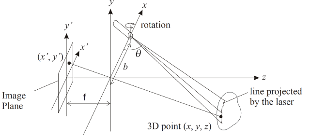
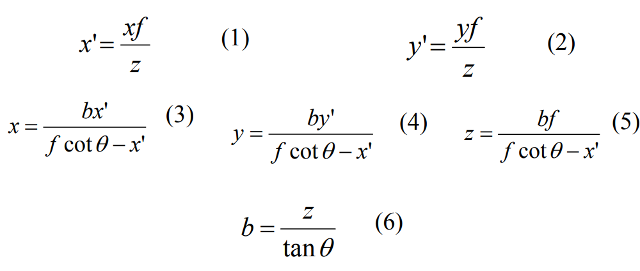
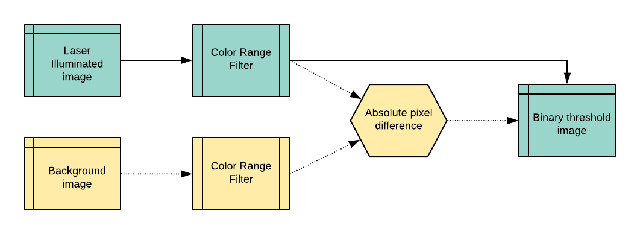
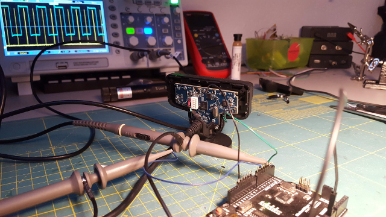
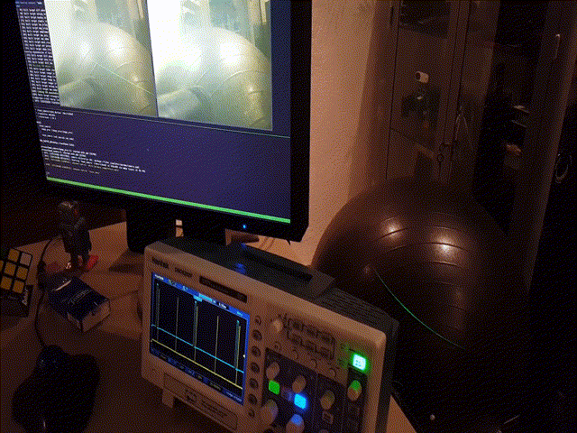
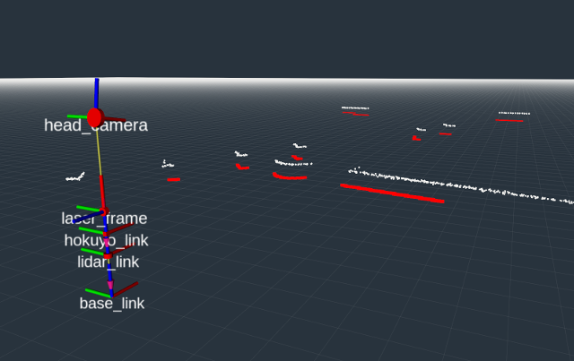
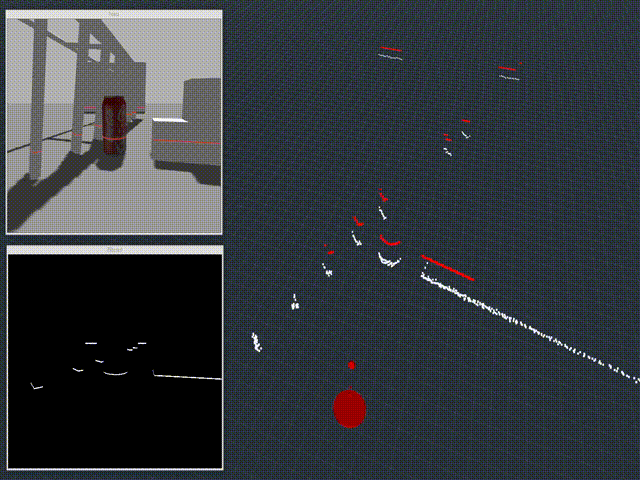
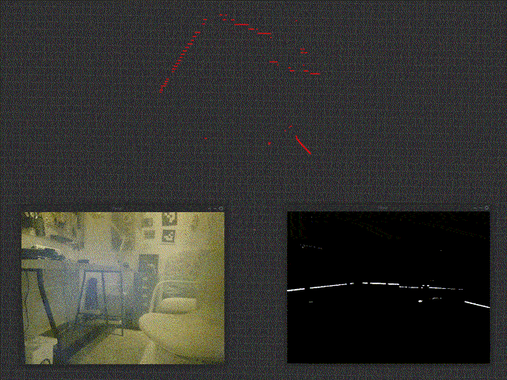

# ros_webcam_lidar
### Webcam and laser line generator based low cost LiDAR for ROS

#### Concept
Concept of operation is simply a pixel-wise triangulation of all laser line points reflected from the object to the imaging surface of the camera. In order to calculate the physical distance of such a point the size of the imaging surface (CCD), focal length of the lens (f), the distance between the laser projector and camera (b) and the angle between the imaging surface and the line generator (theta) must be known:



Then we can use simple trigonometric functions on the pixel coordinates to estimate the distance of each point (x,y,z).



#### Filtering
In order to cancel out all the irrelevant pixels that does not belong to the reflected laser light this package supports two methods:
* One could use a narrow-band-pass optical filter and physically block out a part of the spectrum. _(Potentially old flat-bed scanners might contain such filters.)_
* Or we can modulate the laser illumination by synchronizing to camera frames. *(strobed mode)*
* Essentially these two methods could be combined to achieve a superior filtering effect.



*Normal mode*

The **soft_color_filter** node subscribes to a raw image topic, converts the image to HSV format and applies openCV's range color filter that can be adjusted through dynamic reconfiguration parameters. The published image is binary thresholded so that the *triangulation_node* receives only the relevant pixels. This pathway is marked with blue on the above diagram.

```xml
<node pkg="webcam_lidar" type="soft_color_filter" name="color_filter_node">
  <rosparam file="$(find webcam_lidar)/params/color_filter.yaml"/>
  <param name="camera_topic" value="/head_camera/image_raw"/> <!-- raw camera image -->
  <param name="headless" value="false"/> <!-- display raw feed and color filtered video windows -->
  <param name="strobed_mode" value="false"/> <!-- use only if every second frame is illuminated -->
</node>
```

*Strobed mode*

In this mode the *soft_color_filter* expects alternating images of one laser illuminated frame followed by another without laser light. HSV range filter is then applied to both frames and their absolute difference is rendered to the output.

There are several ways to create such a setup _(e.g. global shutter camera with frame sync. output would be preferred)_, but the most cost effective is probably using the [VSYNC output](http://nuigroup.com/forums/viewthread/12445) of the popular Sony PS3 Eye web camera as trigger:



There is an attached example [firmware](firmware/ps_eye_sync.cpp) for Arduino on how to control the laser to make sure that one frame receives no laser light and the other is illuminated. _Take a closer look on the oscilloscope below (and ignore it on the above picture), the laser is turned on only for a short period of time and slightly before the camera reports frame ready:_



#### Filtered image to pointcloud
The binary thresholded output of the *soft_color_filter* is processed by the **webcam_lidar** node. Camera should be [calibrated](http://wiki.ros.org/camera_calibration), all the other intrinsics such as the size of the CCD and the focal length of the lens can be fine-tuned with dynamically configurable parameters as in *params/lidar_intrinsic.yaml :*

```xml
cam_laser_distance:     0.2       # meters
cam_laser_angle:        1.42      # radians
cam_focal_length:       0.0001    # meters
ccd_vertical_measure:   0.000119  # physical size of the CCD in meters
ccd_horizontal_measure: 0.00015   # meters
pixel_threshold:        0         # luminosity threshold for postfiltering
```
Other launch time parameters:

```xml
<node pkg="webcam_lidar" type="webcam_lidar" name="triangulation_node">
  <rosparam file="$(find webcam_lidar)/params/lidar_intrinsic.yaml"/>
  <param name="use_tf" value="true"/> <!-- get camera to laser transformation from tf -->
  <param name="camera_topic" value="/webcam_lidar/image_filtered"/> <!-- color filtered image topic -->
  <param name="webcam_lidar_frame" value="lidar_link"/> <!-- pointcloud projection frame -->
  <param name="camera_frame" value="head_camera"/> <!-- used for camera to laser transformation if use_tf is set true -->
  <param name="laser_frame" value="laser_frame"/> <!-- used for camera to laser transformation if use_tf is set true -->
</node>
```
When the **use_tf** parameter is set to true, the node will wait until it gets the transformation between *camera_frame* and *laser_frame* at initialization and updates parameters *cam_laser_distance* and *cam_laser_angle* on the parameter server. The **webcam_lidar_frame** on the other hand is the frame from where the pointcloud is to be projected, if the node is used with a URDF model, it is mandatory to place this link in the model parallel to the ground so that the projection is correct. *(As the transformation between the camera and the laser frames can be set as parameters their links could be left out from the model. In that case set *use_tf* parameter to false.)*

#### Usage
The repository contains launch and parameter files for the above mentioned PS3 Eye configuration and a demo world and a simple URDF to use the nodes in a simulated environment.

##### Simulation
The URDF model relies on standard [gazebo_plugins](http://wiki.ros.org/gazebo_plugins): *libgazebo_ros_gpu_laser* used as reference laser scanner (hokuyo_link) and *libgazebo_ros_camera* as webcam (head_camera). It is also using *gazebo projector* with modified textures as laser line generator (laser_frame) *Laser line textures can be found in the media folder.*



Running `simulation.launch` shall load the world, the robot model and start both *color_filter_node* and *triangulation_node* with default parameters. Color filter is started in non-strobed mode and is going to display both the video feed and the output on two separate displays. Rviz is also started and shall show the reference laser scan in white, while the webcam_lidar pointcloud in red:



##### Physical setup
The physical setup requires a bit of tweaking as in many cases the size of the webcam's CCD is unknown. Also the *cam_focal_length*, *cam_laser_distance* and *cam_laser_angle* parameters must be determined quite precisely.
* Start with a calibrated camera and subscribe the color filter to the rectified image.
* Assemble the setup so that the laser line is parallel with the horizontal side of the image.
* Adjust the angle of the laser so that line is at the bottom of the image when an object *(wall)* is in the closest proximity.

Run your modified `lidar.launch` file and open `rqt_reconfigure`. Adjust the color filter until only the laser line is visible in the "Filter" window. Then open `rviz` and use the distance tools to validate your measurements *(alternatively set up an actual lidar and use it as a reference)*, fine tune transformation, lens and CCD parameters until you find the result satisfying.



If you need sensor_msgs/LaserScan as output I recommend using [pointcloud_to_laserscan](http://wiki.ros.org/pointcloud_to_laserscan).

Happy hacking!
